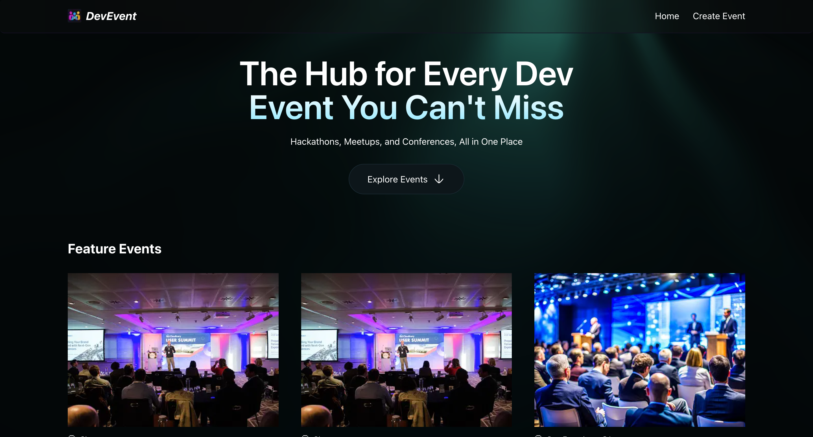

# DevEvents

## Description
Event Platform built to manage and showcase events seamlessly. It features a dynamic home page displaying upcoming events, robust API routes for CRUD operations, Cloudinary-powered image uploads, detailed event pages with registration and similar event suggestions, and integrated analytics to track user engagement and optimize performance.

## Tech Stack
- Cloudinary
- CodeRabbit 
- MongoDB 
- Mongoose 
- Next.js
- PostHog
- Tailwind
- TypeScript

## Features
- Home Page: Displays a dynamic list of events, allowing users to browse upcoming and featured events easily.

- API Routes: Create, update, delete, and fetch events from the database with fully functional endpoints.

- Cloudinary Integration: Use the Cloudinary SDK to easily upload and manage images in the cloud.

- Event Details Page: Shows event information with the ability to register and view a list of similar events.

- Next.js 16 Caching: Implements a completely new approach to caching for improved performance and faster page loads.

- PostHog Analytics: Tracks user interactions and events, providing detailed insights into app usage and behavior.

## Installation
- Install packages: `npm install`

- Create a new file named .env in the root of your project and add the following content:  
* `NEXT_PUBLIC_BASE_URL=http://localhost:3000/`
* Set up `MONGODB_URI` on (MongoDB)
* Set up `CLOUDINARY_URL` on (Cloudinary)
* Set NEXT_PUBLIC_POSTHOG_KEY=
* `NEXT_PUBLIC_POSTHOG_HOST=https://eu.i.posthog.com`

- Running the Project
`npm run dev`

- Open http://localhost:3000 in your browser to view the project.
